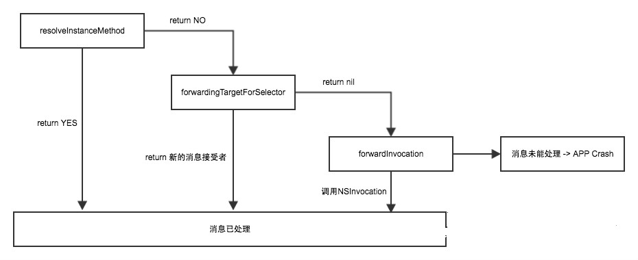
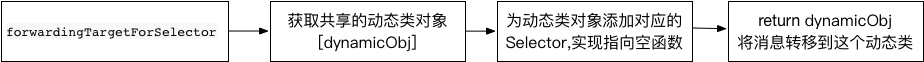
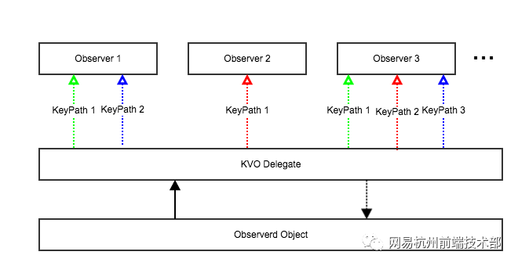
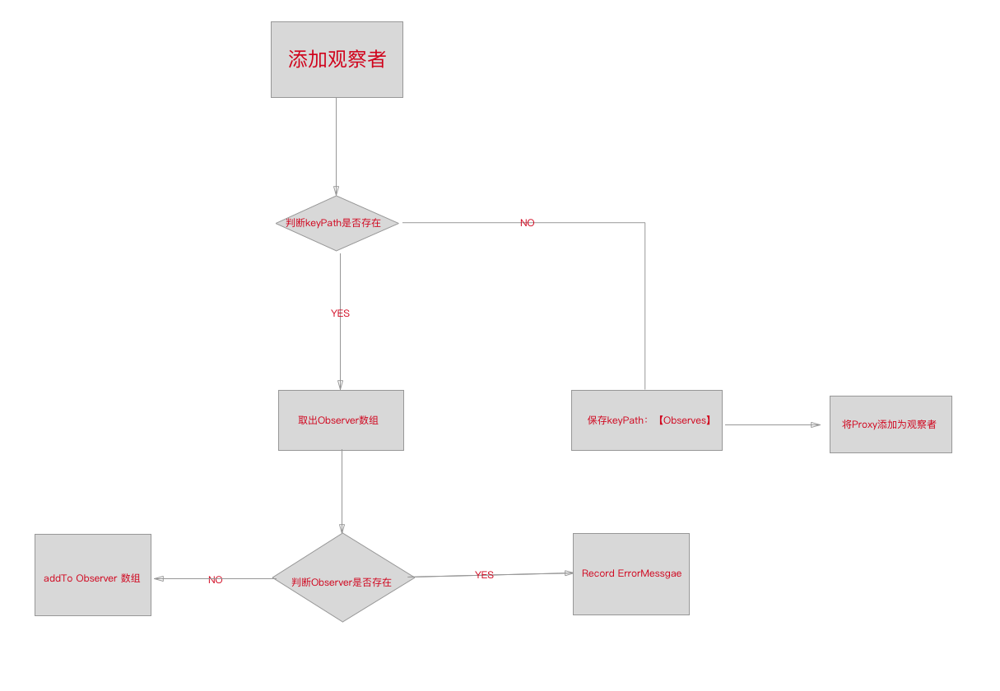
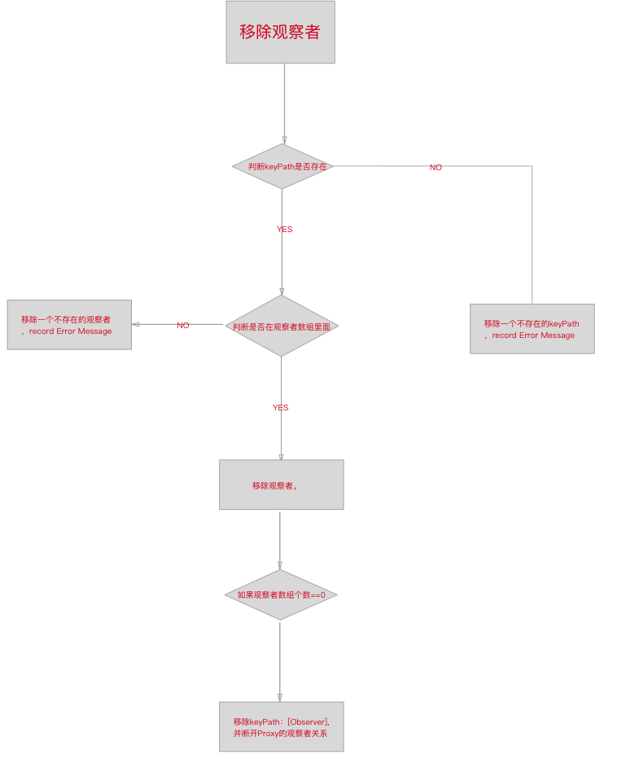
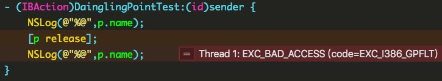
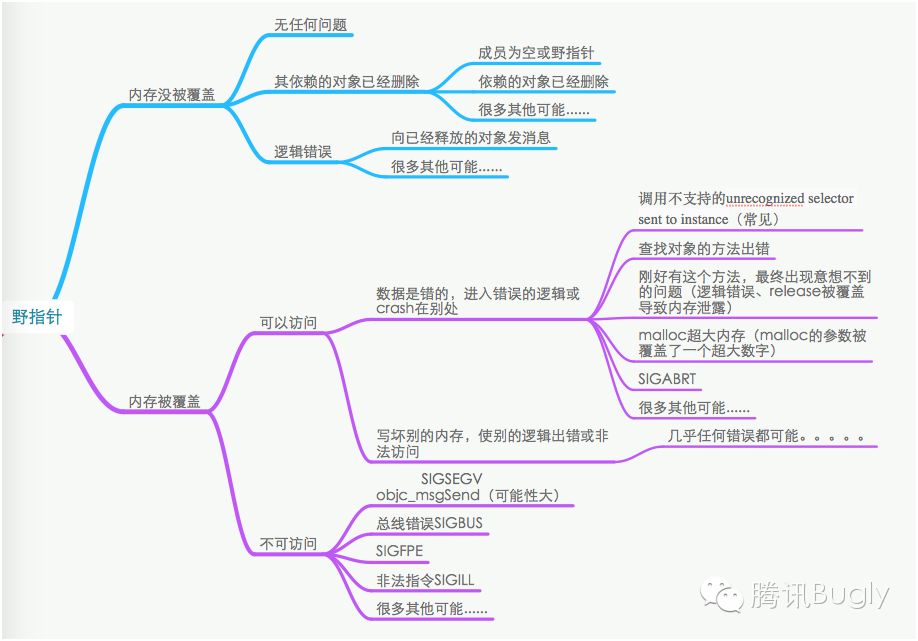

# 前言 

正在运行的 APP 突然 Crash，是一件令人不爽的事，会流失用户，影响公司发展，所以 APP 运行时拥有防 Crash 功能能有效降低 Crash 率，提升 APP 稳定性。但是有时候 APP Crash 是应有的表现，我们不让 APPCrash 可能会导致别的逻辑错误，不过我们可以抓取到应用当前的堆栈信息并上传至相关的服务器，分析并修复这些 BUG。

类似分析:[网易:iOS APP运行时Crash自动修复系统](http://www.yopai.com/show-3-150721-1.html)


# 常见Crash

1. Unrecoginzed Selector Crash
2. KVO Crash
3. Container Crash
4. NSNotification Crash
5. NSNull Crash
6. NSTimer Crash 
7. 野指针 Crash 
8. UI刷新


----

# 1 Unrecoginzed Selector Crash


## 实际案例

```Objc

@implementation UnrecoginzedViewController

- (void)testSelector {
    NSLog(@"%s",__FUNCTION__);
}

// 执行一个存在的Selector
- (IBAction)selectorAction:(id)sender {
    [self performSelector:@selector(testSelector)];
}

// 错误,执行一个Unrecoginzed Selector
- (IBAction)unrecoginzedSelector:(id)sender {
#pragma clang diagnostic push
#pragma clang diagnostic ignored "-Wundeclared-selector"
    [test performSelector:@selector(test)];
#pragma clang diagnostic pop
    
}

@end

```

当执行unrecoginzedSelector的Action时,程序就会崩溃.因为**test**是一个**UnrecoginzedViewController**对象，而**UnrecoginzedViewController**并没有实现**test**这个方法，所以向**self**发送**test**这个方法的时候，将会导致该方法无法在相关的方法列表里找到，最终导致app的crash,异常日志如下:

```
2018-03-18 14:43:32.340558+0800 Demo[2900:449839] -[UnrecoginzedViewController test]: unrecognized selector sent to instance 0x7f8740e21bb0
2018-03-18 14:43:35.617646+0800 Demo[2900:449839] *** Terminating app due to uncaught exception 'NSInvalidArgumentException', reason: '-[UnrecoginzedViewController test]: unrecognized selector sent to instance 0x7f8740e21bb0'
```


## 出现原因

由于 Objective-C 是动态语言，所有的消息发送都会放在运行时去解析，有时候我们把一个信息传递给了错误的类型，就会导致这个错误。

##  解决办法

Objective-C 在出现无法解析的方法时有三部曲来进行消息转发。
详见[Objective-C Runtime 运行时之三：方法与消息](https://southpeak.github.io/2014/11/03/objective-c-runtime-3/)

1. 动态方法解析
2. 备用接收者
3. 完整转发



1 一般适用与 Dynamic 修饰的 Property  
2 一般适用与将方法转发至其他对象  
3 一般适用与消息可以转发多个对象，可以实现类似多继承或者转发中心的概念。  

这里选择的是方案二来进行方法转发来避免崩溃，因为三里面用到了 NSInvocation 对象，此对象性能开销较大，而且这种异常如果出现必然频次较高。最适合将消息转发到一个备用者对象上。

这里新建一个智能转发类。此对象将在其他对象无法解析数据时，返回一个 0 来防止 Crash。返回 0 是因为这个通用的智能转发类做的操作接近向 nil 发送一个消息。

1. 创建一个共享的动态对象类,用于转发
2. 当转发时,动态添加对应的Selector,用一个通用的返回0的函数实现该SEL的IMP
3. 将消息直接转发到这个对象上



动态转发对象代码如下

```Objc

#import <objc/runtime.h>

/// 所有的方法的默认实现
int dynamicFunction(id target, SEL cmd, ...) {
    return 0 ;
}

/// 添加方法
static BOOL __addMethod (Class clazz, SEL sel) {
    NSMutableString *selName = [NSMutableString stringWithString:NSStringFromSelector(sel)];
    int count = (int)[selName replaceOccurrencesOfString:@":"
                                              withString:@"_"
                                                 options:NSCaseInsensitiveSearch
                                                   range:NSMakeRange(0, selName.length)];
    NSMutableString *methodEncoding = [NSMutableString stringWithString:@"i@:"];
    for (int i = 0 ;i < count;i++) {
        [methodEncoding appendString:@"@"];
    }
    [SIDynamicObject shareInstance].realSEL = sel;
    return class_addMethod(clazz, sel, (IMP)dynamicFunction, [methodEncoding UTF8String]);
}

@implementation SIDynamicObject

+ (instancetype)shareInstance {
    static SIDynamicObject *singleton;
    if (!singleton) {
        static dispatch_once_t onceToken;
        dispatch_once(&onceToken, ^{
            singleton = [SIDynamicObject new];
        });
    }
    return singleton;
}

/// 用于动态添加对象方法
- (BOOL)addFunc:(SEL)sel {
    return __addMethod([SIDynamicObject class], sel);
}

/// 用于动态添加类方法
+ (BOOL)addClassFunc:(SEL)sel {
    Class metaClass = objc_getMetaClass(class_getName([SIDynamicObject class]));
    return __addMethod(metaClass, sel);
}

@end

```

我们这里需要 Hook NSObject的 `- (id)forwardingTargetForSelector:(SEL)aSelector` 方法启动消息转发。

```Objc
SIStaticHookClass(NSObject, GuardUR, id, @selector(forwardingTargetForSelector:),(SEL)aSelector) {
    // 系统类不做处理
    if (IsSystemClass([self class])) {
        return SIHookOrgin(aSelector);
    }
    
    // 判断是否可以转为NSString或NSNumber
    if ([self isKindOfClass:[NSNumber class]] && [NSString instanceMethodForSelector:aSelector]) {
        NSNumber *number = (NSNumber *)self;
        NSString *str = [number stringValue];
        return str;
    }
    
    if ([self isKindOfClass:[NSString class]] && [NSNumber instanceMethodForSelector:aSelector]) {
        NSString *str = (NSString *)self;
        NSNumberFormatter *formatter = [[NSNumberFormatter alloc]init];
        NSNumber *number = [formatter numberFromString:str];
        return number;
    }
    
    // 动态转发给动态对象
    BOOL aBool = [self respondsToSelector:aSelector];
    NSMethodSignature *signatrue = [self methodSignatureForSelector:aSelector];
    
    if (aBool || signatrue) {
        return SIHookOrgin(aSelector);
    } else {
        SIDynamicObject *obj = [SIDynamicObject shareInstance];
        obj.realClass = [self class];
        [obj addFunc:aSelector];
        
        NSString *className = NSStringFromClass(obj.realClass);
        NSString *selName = NSStringFromSelector(obj.realSEL);
        NSString *reason = [NSString stringWithFormat:@"[%@ %@]:Unrecoginzed Selector",className,selName];
        [SIRecord recordFatalWithReason:reason errorType:SIGuardTypeUnrecognizedSelector];
        
        return obj;
    }
}

SIStaticHookEnd

```

上述代码只是解决了对象方法的转发,如果要转发对象方法,只需要用类似代码转发类对象。

----

# 2 KVO Crash

## 实际案例

1.注册了,但未实现`-observeValueForKeyPath:ofObject:change:context:`方法 

```
2018-03-18 14:43:32.340558+0800 Demo[2900:449839] -[UnrecoginzedViewController test]: unrecognized selector sent to instance 0x7f8740e21bb0
2018-03-18 14:43:35.617646+0800 Demo[2900:449839] *** Terminating app due to uncaught exception 'NSInvalidArgumentException', reason: '-[UnrecoginzedViewController test]: unrecognized selector sent to instance 0x7f8740e21bb0'
```

2.KVO的被观察者dealloc时仍然注册着KVO导致的crash(经测试在iOS11.X系统上不移除也不会崩溃)

```Objc

- (IBAction)test1:(id)sender {
    Student *s = [[Student alloc] init];
    s.name = @"Test";
    
    [s addObserver:self
        forKeyPath:@"name"
           options:NSKeyValueObservingOptionNew | NSKeyValueObservingOptionOld
           context:nil];
    
    // 延时1000ms后改变stu的name属性值
    dispatch_after(dispatch_time(DISPATCH_TIME_NOW, (int64_t)(0.1 * NSEC_PER_SEC)), dispatch_get_main_queue(), ^{
        s.name = @"Silence";
    });
    
}

```

当对象**s**出方法作用域销毁的时候,没有移除KVO,在iOS11以下会出现以下崩溃信息

```
2018-03-18 15:30:11.386 Demo[4222:574076] student dealloced
2018-03-18 15:30:11.391 Demo[4222:574076] *** Terminating app due to uncaught exception 'NSInternalInconsistencyException', reason: 'An instance 0x618000016c70 of class Student was deallocated while key value observers were still registered with it. 
```

3.使用局部变量进行观察

```Objc

// 使用局部遍历监听,局部变量提前释放导致赋值失效
- (IBAction)test2:(id)sender {
    self.test = @"Hello";
    [self addObserver:[Student new] forKeyPath:@"test" options:(NSKeyValueObservingOptionNew | NSKeyValueObservingOptionOld) context:NULL];
    // 这里赋值会失败,局部变量地址成为野指针
    //[self willChangeValueForKey:@"test"]
    self.test = @"World";
}

```

使用局部变量观察,当赋值时因为观察者已经销毁,会造成赋值野指针

4.添加KVO重复添加观察者或重复移除观察者（KVO注册观察者与移除观察者不匹配）导致的crash

```Objc
- (IBAction)test3:(id)sender {
    self.test = @"Hello";
    [self addObserver:self.obsever forKeyPath:@"test" options:(NSKeyValueObservingOptionNew | NSKeyValueObservingOptionOld) context:NULL];
    self.test = @"World";
    
    [self removeObserver:self.obsever forKeyPath:@"test"];
    self.test = @"One";
    // Cannot remove an observer  for the key path ,because it is not registered as an observer.
    [self removeObserver:self.obsever forKeyPath:@"test"];
}

```

执行上述代码,会发现系统报错:
```
2018-03-18 15:36:43.332 Demo[4291:590904] *** Terminating app due to uncaught exception 'NSRangeException', reason: 'Cannot remove an observer <Student 0x6180000163c0> for the key path "test" from <KVOTestViewController 0x7fb44351d650> because it is not registered as an observer.'
```


## 出现原因

KVOCrash总结下来有以下2大类。

 1. 不匹配的移除和添加关系。
 2. 观察者和被观察者释放的时候没有及时断开观察者关系。

 
## 解决办法

添加一层`KVOProxy`统一管理监听者以及被监听者之间的关系



__问题1 ： 不成对的添加观察者和移除观察者会导致 Crash__  
以往我们使用 KVO，观察者和被观察者都是直接交互的。这里的设计方案是我们找一个 Proxy 用来做转发， 真正的观察者是 Proxy，被观察者出现了通知信息，由 Proxy 做分发。所以 Proxy 里面要保存一个数据结构 {keypath : [observer1, observer2,...]} 。


```Objc

@interface __SIKVOProxy : NSObject {
    __unsafe_unretained NSObject *_observed;
}

// {keyPath:[obj1,obj2](NSHashTable *)}
@property (nonatomic, strong) NSMutableDictionary<NSString *,NSHashTable<NSObject *> *> *kvoInfoMap;

@end

```

我们需要 Hook NSObject的 KVO 相关方法。

```Objc
- (void)addObserver:(NSObject *)observer forKeyPath:(NSString *)keyPath options:(NSKeyValueObservingOptions)options context:(void *)context;
- (void)removeObserver:(NSObject *)observer forKeyPath:(NSString *)keyPath;
```

__1.在添加观察者时__


代码实现如下:

```Objc
SIStaticHookClass(NSObject, GuardKVO, void, @selector(addObserver:forKeyPath:options:context:),(NSObject *)observer, (NSString *)keyPath,(NSKeyValueObservingOptions)options, (void *)context) {
    if(!self.kvoProxy) {
        self.kvoProxy = [[__SIKVOProxy alloc]initWithObserverd:self];
    }
    
    NSHashTable<NSObject *> *os = self.kvoProxy.kvoInfoMap[keyPath];
    if (os.count == 0) {
        // NSPointerFunctionsWeakMemory:不会修改HashTable容器内对象元素的引用计数，并且对象释放后，会被自动移除
        os = [[NSHashTable alloc]initWithOptions:NSPointerFunctionsWeakMemory capacity:0];
        [os addObject:observer];
        
        // 只需要第一次调用的时候调用,将监听者转移到Proxy
        SIHookOrgin(self.kvoProxy,keyPath,options,context);
        
        self.kvoProxy.kvoInfoMap[keyPath] = os;
        return;
    }
    
    if ([os containsObject:observer]) {
        // 多次添加处理
        NSString *className = NSStringFromClass(self.class);
        NSString *selName = NSStringFromSelector(@selector(addObserver:selector:name:object:));
        NSString *reason = [NSString stringWithFormat:@"[%@ %@],Observer:%@ KeyPath:%@  : KVO错误,重复添加监听者",className,selName,observer,keyPath];
        [SIRecord recordFatalWithReason:reason errorType:SIGuardTypeKVO];
        return;
    }
    
    [os addObject:observer];
}

SIStaticHookEnd
```

**2.在移除观察者时**



代码实现如下:

```Objc
SIStaticHookClass(NSObject, GuardKVO, void, @selector(removeObserver:forKeyPath:),
                  (NSObject *)observer, (NSString *)keyPath) {
    NSHashTable<NSObject *> *os = self.kvoProxy.kvoInfoMap[keyPath];
    if (![os containsObject:observer]) {
        // 移除一个不存在的监听
        NSString *className = NSStringFromClass(self.class);
        NSString *selName = NSStringFromSelector(@selector(removeObserver:forKeyPath:));
        NSString *reason = [NSString stringWithFormat:@"[%@ %@],Observer:%@ KeyPath:%@  : KVO错误,移除一个不存在的监听者",className,selName,observer,keyPath];
        [SIRecord recordFatalWithReason:reason errorType:SIGuardTypeKVO];
        return;
    }
    
    [os removeObject:observer];
    
    // 当移除后没有监听者,调用原来的方法移除监听
    if (os.count == 0) {
        SIHookOrgin(self.kvoProxy,keyPath);
        [self.kvoProxy.kvoInfoMap removeObjectForKey:keyPath];
    }
}

SIStaticHookEnd_SaveOri(__si_hook_orgin_function_removeObserver)
```

__问题2: 观察者和被观察者释放的时候没有断开观察者关系。__  
对于观察者， 既然我们是自己用 Proxy 做的分发，我们自己就需要保存观察者，这里我们简单的使用 `NSHashTable` 指定指针持有策略为 `weak` 即可(如果数据为空后,会自动移除对象)。

我们在被观察者上绑定一个关联对象，在关联对象的 dealloc 方法中做相关操作即可。

```Objc
- (void)dealloc {
    NSDictionary<NSString *,NSHashTable<NSObject *> *> *kvoInfos = self.kvoInfoMap.copy;
    for (NSString *keyPath in kvoInfos) {
        // 调用removeObserver:forKeyPath:
        __si_hook_orgin_function_removeObserver(_observed,@selector(removeObserver:forKeyPath:),self,keyPath);
    }
}

```

 ----

# 3 Container Crash

## 实际案例

1. 在容器内添加nil `@[nil]`
2. 数组越界`objectAtIndex`

## 出现原因

容器在任何编程语言中都尤为重要，容器是数据的载体，很多容器对容器放空值都做了容错处理。不幸的是 Objective-C 并没有，容器插入了 `nil` 就会导致 Crash，容器还有另外一个最容易 Crash 的原因就是下标越界。

## 解决办法

常见的容器有 NS(Mutable)Array , NS(Mutable)Dictionary, NSCache 等。我们需要 hook 常见的方法加入检测功能并且捕获堆栈信息上报。

例如

```Objc

SIStaticHookClass(NSArray, GuardCont, id, @selector(objectAtIndex:), (NSUInteger)index) {
    if (index >= self.count) return nil;
    return SIHookOrgin(index);
}
SIStaticHookEnd

SIStaticHookPrivateClass(__NSSingleObjectArrayI, NSArray *, GuardCont, id, @selector(objectAtIndex:), (NSUInteger)index) {
    if (index >= self.count) return nil;
    return SIHookOrgin(index);
}
SIStaticHookEnd

SIStaticHookPrivateClass(__NSArrayI, NSArray *, GuardCont, id, @selector(objectAtIndex:), (NSUInteger)index) {
    if (index >= self.count) return nil;
    return SIHookOrgin(index);
}
SIStaticHookEnd

```

但是需要注意的是 NSArray 是一个 Class Cluster 的抽象父类，所以我们需要 Hook 到我们真正的子类。


# 4 NSNotification Crash

## 实际案例
```
- (void)viewDidLoad {
    [super viewDidLoad];
    
    // 注册
    // If your app targets iOS 9.0 and later or macOS 10.11 and later, you don't need to unregister an observer in its dealloc method. Otherwise, you should call removeObserver:name:object: before observer or any object passed to this method is deallocated.
    [[NSNotificationCenter defaultCenter] addObserver:self selector:@selector(noti:) name:@"noti" object:nil];
}

// 当用户dealloc时,没有移除在iOS8及以下会崩溃
- (void)dealloc {
    NSLog(@"ObserverViewController dealloc");
}
```

## 出现原因

当一个对象添加了notification之后，如果dealloc的时候，仍然持有notification，就会出现NSNotification类型的crash。 

所幸的是，苹果在iOS9之后专门针对于这种情况做了处理，所以在iOS9之后，即使开发者没有移除observer，Notification crash也不会再产生了,猜想可能是 iOS9 之后系统将通知中心持有对象由 `assign` 变为了`weak`。

不过针对于iOS9之前的用户，我们还是有必要做一下NSNotification Crash的防护的。

## 解决办法

NSNotification Crash的防护原理很简单， 利用method swizzling hook NSObject的dealloc函数，再对象真正dealloc之前先调用一下
[[NSNotificationCenter defaultCenter] removeObserver:self] 即可。

因此我们在给监听者添加一个通知时,同时强引用一个`remover`,我们在`remover`的`dealloc`方法移除监听.在监听者销毁时就会调用`remover`的`dealloc`方法,一次可以自动重消息中心移除监听对象

Observer的代码如下:

```Objc
@interface __SIObserverRemover : NSObject
@end

@implementation __SIObserverRemover {
    __strong NSMutableArray *_centers;
    __unsafe_unretained id _obs;
}

- (instancetype)initWithObserver:(id)obs {
    if (self = [super init]) {
        _obs = obs;
        _centers = [NSMutableArray array];
    }
    return self;
}

- (void)addCenter:(NSNotificationCenter *)center {
    if (center) {
        [_centers addObject:center];
    }
}

- (void)dealloc {
	 for (NSNotificationCenter *center in _centers) {
        [center removeObserver:_obs];
    }
}

@end
```

当添加监听者是,自动绑定一个`remover`:

```Objc
void addCenterForObserver(NSNotificationCenter *center,id obs) {
    __SIObserverRemover *remover;
    static char removerKey ;
    @autoreleasepool {
        remover = objc_getAssociatedObject(obs, &removerKey);
        if (!remover) {
            remover = [[__SIObserverRemover alloc] initWithObserver:obs];
            /// 与观察者绑定
            objc_setAssociatedObject(obs, &removerKey, remover, OBJC_ASSOCIATION_RETAIN_NONATOMIC);
        }
        [remover addCenter:center];
    }
}
```

- - - - -

# 5 NSNull Crash

## 实际案例
测试使用的JSON数据如下:  

```JSON
{
    "flag": "0",
    "msg": "Some Mssage",
    "data": null
}
```

解析这个JSON对象:

```Objc
- (IBAction)jsontest:(id)sender {
    NSString *path = [[NSBundle mainBundle]pathForResource:@"test" ofType:@"json"];
    NSData *jsonData = [NSData dataWithContentsOfFile:path];
    NSDictionary *testJson = [NSJSONSerialization JSONObjectWithData:jsonData options:NSJSONReadingMutableContainers error:nil];
    NSLog(@"%@",testJson);
    
    id data = [testJson objectForKey:@"data"];
    NSLog(@"%@",[data class]);
    
    
    // 假定data为Sting,调用String的方法
    // 如果不加守护默认会崩溃
    NSLog(@"%@",[data lowercaseString]);
}
```

崩溃日志显示:

```
2018-03-18 16:29:35.217 Demo[4763:702578] -[NSNull lowercaseString]: unrecognized selector sent to instance 0x110a05180
2018-03-18 16:29:35.221 Demo[4763:702578] *** Terminating app due to uncaught exception 'NSInvalidArgumentException', reason: '-[NSNull lowercaseString]: unrecognized selector sent to instance 0x110a05180
```


## 出现原因

虽然 Objecttive-C 不允许开发者将 nil 放进容器内，但是另外一个代表用户态 `空` 的类 NSNull 却可以放进容器，但令人不爽的是这个类的实例，并不能响应任何方法。 

容器中出现 NSNull 一般是 API 接口返回了含有 null 的 JSON 数据，
调用方通常将其理解为 NSNumber，NSString，NSDictionary 和 NSArray。 这时开发者如果没有做好防御 一旦对 NSNull 这个类型调用任何方法都会出现 unrecongized selector 错误。 


## 解决办法

我们在 NSNull 的转发方法中可以判断上面的四种类型是否可以解析。如果可以解析直接将其转发给这几种对象，如果不能则调用父类的默认实现。


```Objc
// NSNull数据Selector问题,常见于数据为空解析
// 实现原理,将其转发给Number,String,Array,Dictionary避免出现Unrecoginzed
XXStaticHookClass(NSNull, ProtectNull, id, @selector(forwardingTargetForSelector:), (SEL) aSelector) {
SIStaticHookClass(NSNull, GuardNull, id, @selector(forwardingTargetForSelector:), (SEL) aSelector) {
    static NSArray *tmpObjs ;
    if (!tmpObjs) {
        tmpObjs = @[@"",@0,@[],@{}];
    }
    
    for (id tmpObj in tmpObjs) {
        if ([tmpObj respondsToSelector:aSelector]) {
            return tmpObj;
        }
    }
    return SIHookOrgin(aSelector);
}

```

- - - - -

#  6. NSTimer Crash 

## 实际案例
```
@implementation NSTimerViewController

- (void)viewWillDisappear:(BOOL)animated {
//    if (self.timer) {
//        [self.timer invalidate];   // 移除runloop
//        self.timer = nil ;   // 解决循环引用
//    }
}
- (IBAction)fire:(id)sender {
    self.timer = [NSTimer scheduledTimerWithTimeInterval:0.5 target:self selector:@selector(fireTimer:) userInfo:@{@"Test":@"Hello,World"} repeats:YES];
}

- (void)fireTimer:(NSTimer *)timer {
    NSLog(@"userinfo is %@",timer.userInfo);
}

-(void)dealloc {
    NSLog(@"NSTimerViewController dealloc");
}

@end

```

按照上述使用NSTimer,会发现Controller持有timer,然后timer又会引用timer,并且我们没有正确关闭定时器,会产生循环引用,造成dealloc方法始终无法调用


## 出现原因

系统默认对象持有关系:

需要注意的是，这种无限循环的 timer，会一直执行，需要调用[timer invalidate]显式停止。否则 runloop 会一直引用着 timer，timer 又引用了 self，导致 self 整个对象泄漏，实际情况中，这个 self 有可能是一个 view，甚至是一个 controller。

同时注意,`[timer invalidate]`不能在`dealloc`方法中调用,因此没有意义.因为 `timer` 会引用住 `self`，在 `timer` 停止之前，是不会释放 `self` 的，`self` 的 `dealloc` 也不可能会被调用。
正确的做法应该是根据业务需要，在适当的地方启动 `timer` 和 停止 `timer`。比如 `timer` 是页面用来更新页面内部的 `view` 的，那可以选择在页面显示的时候启动 `timer`，页面不可见的时候停止 `timer`。

比如如果是一个ViewController可以再`viewDidDisappear`方法中调用:

```Objc
- (void)viewWillDisappear:(BOOL)animated {
    if (self.timer) {
        [self.timer invalidate];   // 移除runloop
        self.timer = nil ;   // 解决循环引用
    }
}

```

## 解决办法

同 KVO 一样，既然 timer 和 target 直接交互容易出现问题，我们就再找个代理将 target 和 selctor 等信息保存到 Proxy 里，并且是弱引用 target。  
这样避免因为循环引用造成的内存泄漏。然后在触发真正 target 事件的时候如果 target 置为 nil 了这时候手动去关闭定时器。

给Timer添加一个引用的Proxy,并Hook 相关方法绑定:

```Objc

@interface NSTimer (__SITimerProxy)

@property (nonatomic,strong) __SITimerProxy *timerProxy;

@end

@implementation NSTimer (__SITimerProxy)

- (void)setTimerProxy:(__SITimerProxy *)timerProxy {
    objc_setAssociatedObject(self, @selector(timerProxy), timerProxy, OBJC_ASSOCIATION_RETAIN_NONATOMIC);
}

- (__SITimerProxy *)timerProxy {
    return objc_getAssociatedObject(self, _cmd);
}

@end

SIStaticHookMetaClass(NSTimer, GuardTimer, NSTimer *, @selector(scheduledTimerWithTimeInterval:target:selector:userInfo:repeats:),
                      (NSTimeInterval)ti , (id)aTarget, (SEL)aSelector, (id)userInfo, (BOOL)yesOrNo){
    if (yesOrNo) {
        __SITimerProxy *proxy = [[__SITimerProxy alloc]init];
        proxy.target = aTarget;
        proxy.className = NSStringFromClass([aTarget class]);
        proxy.aSelector = aSelector;
        NSTimer *timer = SIHookOrgin(ti,proxy,@selector(trigger:),userInfo,yesOrNo);
        timer.timerProxy = proxy;
        proxy.sourceTimer = timer;
        return timer;
    }
    
    return SIHookOrgin(ti, aTarget, aSelector, userInfo, yesOrNo);
}

SIStaticHookEnd
```

当触发Timer的Selector的时候,通过Proxy进行转发,如果转发失败说明没有正确移除Timer,在Proxy中移除Timer:

```Objc

/// TimerProxy
@implementation __SITimerProxy

// 用来转发Selector
- (void)trigger:(id)userinfo {
    id strongTarget = self.target;
    if (strongTarget && [strongTarget respondsToSelector:self.aSelector]) {
        [strongTarget performSelector:self.aSelector withObject:userinfo];
    }else {
        // target已经销毁或者其他原因无法触发
        NSString *className = self.className;
        NSString *selName = NSStringFromSelector(self.aSelector);
        NSString *reason = [NSString stringWithFormat:@"[%@ %@],Timer:%@ 没有正确移除",className,selName,self.sourceTimer];
        [SIRecord recordFatalWithReason:reason errorType:SIGuardTypeTimer];
        
        NSTimer *sourceTimer = self.sourceTimer;
        if(sourceTimer){
            // 将timer移除RunLoop
            [sourceTimer invalidate];
        }
    }
}

@end

```
- - - - -

# 7. 野指针 Crash 

## 实际案例
在App的所有Crash中，访问野指针导致的Crash占了很大一部分，野指针类型crash的表现为：`Exception Type:SIGSEGV`，`Exception Codes: SEGV_ACCERR`,简单案例如下:



上述内存释放后,就会变成野指针,再次放回就会造成Crash

## 出现原因

一般在单线程条件下使用 ARC 正确的处理引用关系野指针出现的并不频繁， 但是多线程下却出现概率比较大，通常在一个线程中释放了对象，另外一个线程还没有更新指针状态后续访问就可能会造成随机性bug。

被回收的内存不一定立马被使用,而且崩溃的位置可能也与原来的逻辑相聚很远，因此收集的堆栈信息也可能是杂乱无章没有什么价值。XCode本身为了便于开放调试时发现野指针问题，提供了Zombie机制，能够在发生野指针时提示出现野指针的类，从而解决了开发阶段出现野指针的问题。然而针对于线上产生的野指针问题，依旧没有一个比较好的办法来定位问题。

野指针的具体的分类如下图所示:



## 解决办法

这里我们可以借用系统的NSZombies对象的设计。
参考[buildNSZombie](https://mikeash.com/pyblog/friday-qa-2014-11-07-lets-build-nszombie.html)


解决过程

1. 建立白名单机制，由于系统的类基本不会出现野指针，而且 hook 所有的类开销较大。所以我们只过滤开发者自定义的类。
2. hook dealloc 方法 这些需要保护的类我们并不让其释放，而是调用objc_desctructInstance 方法释放实例内部所持有属性的引用和关联对象。
3. 利用 object_setClass(id，Class) 修改 isa 指针将其指向一个Proxy 对象(类比系统的 KVO 实现)，此 Proxy 实现了一个和前面所说的智能转发类一样的 `return 0`的函数。
4. 在 Proxy 对象内的 `- (void)forwardInvocation:(NSInvocation *)anInvocation` 中收集 Crash 信息。
5. 缓存的对象是有成本的，我们在缓存对象到达一定数量时候将其释放(object_dispose)。

核心代码如下:

```Objc
- (void)si_wildPointer_dealloc {
    Class selfClazz = object_getClass(self);
    
    BOOL needProtect = NO;
    for (NSString *className in [SIWildPointerManager manager].classArr) {
        Class clazz = objc_getClass([className UTF8String]);
        if (clazz == selfClazz) {
            needProtect = YES;
            break;
        }
    }
    
    // 如果需要添加也指针保护,不销毁对象,指向Proxy对象
    if (needProtect) {
        objc_destructInstance(self);
        NSString *className = [NSString stringWithFormat:@"SIGuard_%@",NSStringFromClass(selfClazz)];
        // 注册一个新子类
        Class proxyClass = objc_allocateClassPair([SIWildPointerProxy class], [className UTF8String], 0);
        objc_registerClassPair(proxyClass);
        object_setClass(self, proxyClass);
        
        undellocedList.size();
        if (undellocedList.size() >= threshold) {
            id object = undellocedList.front();
            Class objClass = [object class];
            undellocedList.pop_front();
            free(object);
            objc_disposeClassPair(objClass);
        }
        undellocedList.push_back(self);
    } else {
        [self si_wildPointer_dealloc];
    }
}
```

- - - - 

# 8. UI刷新

## 实际案例
在非主线程刷新UI会产生未知错误

## 产生原因
在非主线程刷UI将会导致app运行crash，有必要对其进行处理,将其转移到主线程刷新

## 解决办法
初步的处理方案是swizzle UIView类的以下三个方法：

```Objc
- (void)setNeedsLayout;
- (void)setNeedsDisplay;
- (void)setNeedsDisplayInRect:(CGRect)rect;
```

简单Hook UIView的这几个方法,强制指定到主线程执行:

```Objc
SIStaticHookClass(UIView, GuardUI, void, @selector(setNeedsDisplay)) {
    if (strcmp(dispatch_queue_get_label(DISPATCH_CURRENT_QUEUE_LABEL), dispatch_queue_get_label(dispatch_get_main_queue())) == 0) {
        SIHookOrgin();
    } else {
        dispatch_async(dispatch_get_main_queue(), ^{
            SIHookOrgin();
        });
    }
}
SIStaticHookEnd

SIStaticHookClass(UIView, GuardUI, void, @selector(layoutSubviews)) {
    if (strcmp(dispatch_queue_get_label(DISPATCH_CURRENT_QUEUE_LABEL), dispatch_queue_get_label(dispatch_get_main_queue())) == 0) {
        SIHookOrgin();
    } else {
        dispatch_async(dispatch_get_main_queue(), ^{
            SIHookOrgin();
        });
    }
}
SIStaticHookEnd

SIStaticHookClass(UIView, GuardUI, void, @selector(setNeedsUpdateConstraints)) {
    if (strcmp(dispatch_queue_get_label(DISPATCH_CURRENT_QUEUE_LABEL), dispatch_queue_get_label(dispatch_get_main_queue())) == 0) {
        SIHookOrgin();
    } else {
        dispatch_async(dispatch_get_main_queue(), ^{
            SIHookOrgin();
        });
    }
}
SIStaticHookEnd
```


但这几个方法并不能全部覆盖全部UI刷新方法,因此在开发中还需注意,刷新UI如果不确定是否在主线程就必须指定到主线程进行刷新


